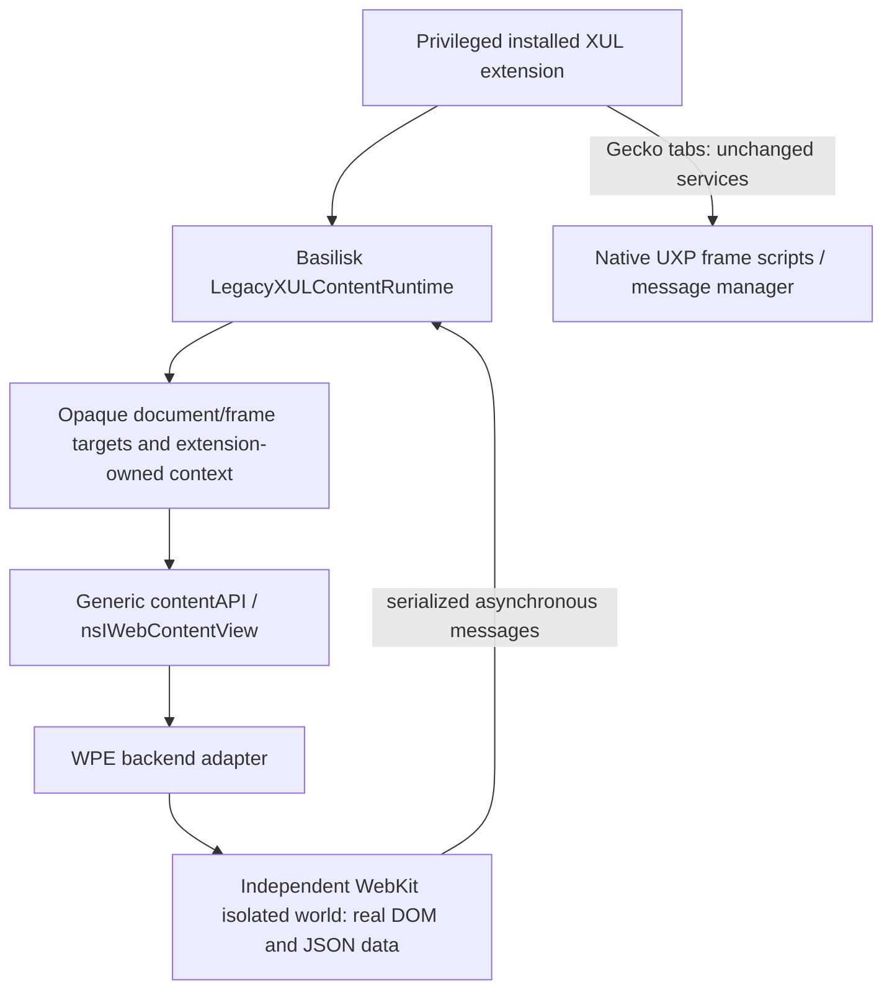

# Basilisk legacy content services (Phase 5)

This is an **opt-in runtime**, not a transparent replacement for `Cu.Sandbox`,
`Services.scriptloader`, Gecko document observers or the native message manager.
Unmodified uBlock does not automatically consume it. The new facility proves that
persistent content execution, ordered loading and synchronous *local data* access
are implementable without pretending WebKit has Gecko DOM objects.

All implementation is in the Basilisk repository. The UXP platform is consumed
unchanged. No new QI interfaces pretend to be a Gecko window, document or channel.

## Contract

An installed extension calls `window.LegacyXULContentRuntime.open(browser)` and
awaits a context. It needs `CAP_EXECUTION_WORLDS`; Gecko callers continue using
native UXP services. No native Gecko API or extension registration is intercepted.

| Context operation | Supported meaning |
| --- | --- |
| `createTarget(frameId?)` | Opaque handle for a live frame/document in this context; omitted ID selects top frame |
| `executeScript(target, source)` | Async function body in the target world; JSON result or rejection |
| `loadSubScript(uri, target)` | Extension-owned content source loaded in call order at global scope; completion value discarded, errors reject with source URI |
| `setData(target, value)` | Versioned JSON snapshot installed before subsequent queued work |
| `setDefaultData(value)` | Snapshot for future registered documents, updates existing targets and future registrations |
| `loadFrameScript(uri, {runAt, allFrames})` | Returns owned registration token for future documents; real document-start/end phases |
| `removeDelayedFrameScript(token)` | Removes that future registration, not already executed page effects |
| `insertCSS(source, {allFrames})`, `removeCSS(token)` | Owned persistent content user-sheet registration/removal; does not touch chrome styles |
| `sendAsyncMessage(target, name, data)` | Serialized dispatch to target-local callbacks |
| `broadcastAsyncMessage(name, data)` | Dispatch to currently discovered live targets, not an invented global frame topology |
| `add/removeMessageListener(name, fn)` | Receives `{name,data,target,frame}` with runtime-owned target/frame identity |
| `add/removeProgressListener(fn)` | Generic URI/title/loading/navigation/audio state snapshots, not nsIWebProgress/docshell objects |
| `destroyTarget(target)` | Revokes the handle/subscription; does not erase an otherwise live document's JS world |
| `close()` | Revokes context, handles, listeners and owned future registrations; async native-world release |

`loadSubScript` queue slots are reserved before asynchronous source loading. A
failure rejects the corresponding call without silently discarding later calls.
Scripts share globals in a context/world for the document lifetime. Different
contexts and frames have separate globals. No SpiderMonkey closure is serialized.

`document-idle` is deliberately rejected by this runtime. Upstream start/end user
scripts are supported; a delayed end callback is not claimed to implement the
full Gecko idle scheduling contract. Existing generic contentAPI scheduling is
unchanged. Registration has no immediate injection into already loaded documents;
use a target to execute against those documents. Async source loading cannot turn
a missed document-start deadline into a real document-start injection.

CSS registration completion acknowledges the embedding API registration, not a
paint or synchronous style-flush guarantee. Current API supplies top/all-frame
CSS, not individual-frame native user-sheet registration.

## Content bindings and configuration

Each world receives read-only `legacyContent`, with:

* `getData(key)` and `dataVersion`: synchronous reads of recursively frozen local
  JSON data, installed before dependent source runs;
* `sendAsyncMessage`, `addMessageListener`, `removeMessageListener`: named local
  callback registry with serialized messages. The same three names are available
  as globals for suitable frame-script-style content code.

Configuration producers remain privileged. The runtime does not discover a
private extension closure or infer its inputs. A producer must explicitly supply
and update snapshots. Consequently this is a general mechanism for the purpose
of script-tag filter data, **not** an automatic implementation of uBlock's private
`getScriptTagFilters` function. No Components, Services, arbitrary XPCOM, native
pointers or privileged window is bound into the world.

Host delivery polls each live target at most once per 250 ms through its ordered
queue. New registered frames are discovered every 500 ms; this does not delay
native script injection, only browser-side message delivery. Queues cap messages
and bytes; script/native payloads are bounded. A long-running async operation can
delay later messages until its timeout. This is suitable for initial compatibility
services, not a claim of zero-cost/high-throughput message-manager parity.

## Identity and security

An extension context is associated with the installed active add-on owning its
actual resource callsite, using existing AddonManager mapping. Source loading is
restricted to that add-on's chrome/resource/file/jar URLs. Returned facades expose
no world key or mutable owner state. A target is recognized by WeakMap membership,
owner, original view/client, backend-issued document epoch and native frame lifetime.
Stale and cross-context handles fail. Context facades belong to their chrome
window; do not retain and invoke a discarded window's JS globals after it closes. Message delivery carries the validated frame
from the operation, not a frame ID supplied in message data.

Legacy XUL extensions already have system-principal powers. Callsite provenance
is an accidental-misrouting/ownership guard, **not a sandbox against a malicious
system-privileged extension** that can execute arbitrary chrome code or forge
script provenance. No stronger cross-extension security principal is claimed.
Page isolation relies on real native script worlds; ordinary page JS cannot obtain
host objects or select another world's bridge. Content source's conservative
privileged-global check is eligibility screening, not a JavaScript security parser.

A native completion is accepted only for its pending operation and owning world.
Release revokes its binding and rejects its pending operations. Navigation/frame
removal revokes document targets. Tab close, engine replacement, add-on disable/
uninstall and window unload release context-owned registrations. Process failure
revokes targets and pauses discovery; normal navigation can initialize new targets.
Private contexts share no snapshot/configuration persistence with other contexts;
this runtime adds no disk storage.

## Native implementation and future backends

`executeWorldScript`, `prepareWorld`, `releaseWorld`, `registerWorldScript` are
project-owned interfaces with strings/flags and serialized results. WPE types stay
in Basilisk's backend directory. WPE uses public script-world/user-script APIs and
normal asynchronous WebProcess messages. Named-world identifiers are supplied
through public WebProcess initialization data so crash restoration joins the same
world as restored user scripts. Only opaque names travel in that initialization
list, never extension configuration or URLs.

A future backend must advertise independent execution worlds only when it can
preserve document-local global state, world separation, native script timing and
lifetime revocation. WKWebView/future Windows implementation is not supplied. If
its public APIs cannot address individual frames in an owned world, it must reject
that capability rather than substitute a top frame or emulate a DOM.

## Remaining unchanged-extension boundary

The service-purpose results narrow, but do not erase, the previous stop condition:

* uBlock `frameModule.js:324-329` still calls real `Cu.Sandbox([win], ...)` using a
  Gecko window/prototype; :332-458 assigns captured privileged functions to it.
* `frameScript.js:21-45`, `frameScript0.js:36-51`, and `frameModule.js:545-572`
  acquire Gecko docshell/documents and invoke that loader. Browser-side wrappers
  cannot make these native Gecko notifications contain foreign documents.
* `Services.scriptloader.loadSubScript` still receives an actual sandbox global.
  This runtime neither overwrites shared UXP services nor translates arbitrary
  privileged loader programs. Installing an opt-in API cannot change references
  already captured by those programs.
* Snapshot data needs an explicit producer/invalidation contract; the runtime
  cannot copy the private `scriptTagFilterer` closure. Its data purpose is possible,
  while transparent binding of this unchanged callsite remains unavailable.
* `beforescriptexecute` cancellation remains a separate Gecko-specific event
  contract; a MutationObserver is not a before-execution replacement.

A future extension adaptation could retain native Gecko paths and explicitly use
these content services for alternate targets. None was applied. A universal
source-preserving loader/interposition mechanism is not implemented and must not
be described as proven impossible merely because it is absent. Modifying UXP,
special-casing private extension sources or fabricating its window arguments is
outside this phase's boundaries.

Live network decisions remain separately blocked by the public backend API. See
[the upstream proposal](request-broker-proposal.md), not the content runtime, for
that missing attributed/deferred request contract.
