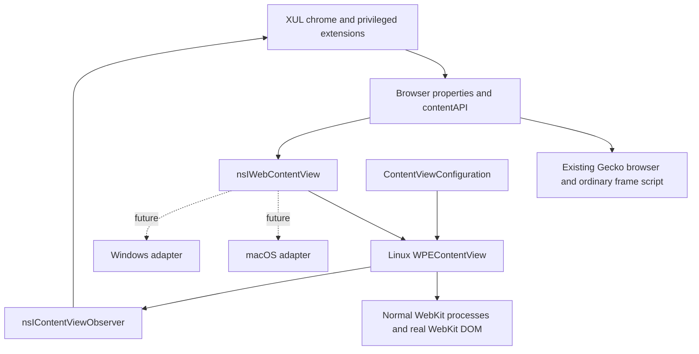

# Alternate content-engine boundary

The optional content backend is now behind project-owned XPIDL/C++ interfaces.
Gecko remains the normal browser implementation. It is not forced through a new
docshell or native-view abstraction. XUL owns windows, tabs, commands and policy.



## Source and ownership

* `basilisk/components/contentengine/nsIWebContentView.idl`: main-thread content
  lifetime, navigation, state, view, edit/find, zoom/audio, Inspector/fullscreen,
  asynchronous script, stylesheet/registration and declarative policy contract.
* `nsIContentViewObserver.idl`: reverse callbacks; sender is the project view,
  payloads are project interfaces or property bags with serialized values.
  [Event schemas](content-view-events.md) define the reverse protocol.
* `ContentViewConfiguration.{h,cpp}`: authoritative UXP profile, private-window
  identity and optional user agent. No website-data-store types cross this boundary.
* `nsIContentRequestRule.idl`: stable URL-prefix and resource-class rule values.
* `components/contentengine/wpe/`: all WPE/WebKit/GTK types, host embedding,
  normal/ephemeral sessions, process/Inspector objects and callbacks. The existing
  working native host was moved, not replaced. The component contract selects an
  engine: `@basilisk-browser.org/content-view;1?engine=webkit`.
* `base/content/contentengine/`: generic browser adapter, contentAPI, session,
  context, find, fullscreen, Inspector presentation and engine routing.

The native view still mounts a child surface within the XUL browser rectangle.
Device-pixel bounds and a `mozIDOMWindowProxy` identify the chrome host, never the
foreign document. A bookkeeping Gecko browser remains for established tab/session
machinery. Alternate contentDocument/contentWindow getters return null. This is
an intentional implementation constraint, not foreign DOM emulation.

Destroy is idempotent. Native callbacks retain their sender across reentrant XUL
calls. Pending operations reject on replacement, process failure or closure;
stale native replies cannot reinstall removed policies. Process failure permits
reload. Each view owns its own scripts, styles, filters and isolated-world bridge.

## Capabilities and extension API

`browser.contentEngine`, `browser.contentCapabilities` and
`browser.contentAPI.capabilities` are privileged, read-only state. Capability bits
are defined in XPIDL, not inferred from the OS or WebKit version in chrome. The
model covers developer tools/target inspection, fullscreen, downloads, scripts,
isolated worlds, persistent/private storage, audio, CSS, registrations, messaging,
find and request filtering. Unsupported permission, TLS identity, detailed
progress and favicon services are not advertised. Private views exclude unsafe
Inspector and disk-backed filter-store operations.

The [content bridge contract](wpe-content-bridge.md) describes executeScript,
sendMessage/listeners, insertCSS/removeCSS and registerScript/unregisterScript.
Scripts run in the real engine's content world and return JSON. Existing Gecko
frame-script/message-manager semantics remain untouched. A dedicated ordinary
Gecko frame script implements only this opt-in portable API. No synchronous
message API, native objects or privileged chrome globals enter the WebKit world.

Cross-window alternate-tab adoption now copies serialized script/style/policy
definitions into the destination client before its first page load. Chrome
callbacks are not copied across window lifetimes. Same-window replacement retains
client identity/listeners. Definitions are in-memory, not executable session data;
extensions must register again after application restart. Top-level document-end
scripts and top-level user CSS are the current contract; all-frame/document-start
options are possible future adapter work, not an upstream blocker.

## Request policy version 1

```js
const api = gBrowser.selectedBrowser.contentAPI;
await api.setRequestRules("extension:tracking", [{
  urlPrefix: "https://tracker.example/collect",
  resourceTypes: ["script", "fetch"]
}]);
gBrowser.selectedBrowser.loadURI("https://example.org/");
// Later:
await api.removeRequestRules("extension:tracking");
```

Rules block matching requests; unmatched requests remain allowed. Prefix matching
uses the canonical ASCII HTTP(S) URI and is case-sensitive. Resource classes are
image, stylesheet, script, font, media, document and fetch (XHR/Fetch). An omitted
class list means all classes. Unknown fields/types reject, including origin
fields: origin attribution is never guessed. This intentionally small API is not
an adblock rule language, regex ABI or imperative per-request hook.

Tokens are per view. Compilation/replacement is asynchronous and atomic; failure
leaves an existing compiled policy in place. Await installation before navigation.
Switching and alternate-tab adoption wait for registrations/policies before the
destination URI loads; a setup failure leaves the destination unloaded. Definitions
survive Gecko intervals but do not replace Gecko's native request-policy services;
the portable request-filter bit is absent on Gecko. Existing Gecko blockers keep
their real nsIContentPolicy/nsIChannel semantics.

The WPE adapter translates typed rules into upstream content filters. Normal
compiled policies are stored beneath the profile's `webkit/content-filters` using
the supported filter-store API and removed through that API on replacement/close.
A crash can leave compiled cache files. Private mode rejects this feature because
the public compiler store requires a filesystem directory; no private rules are
written into the persistent profile. An ephemeral compiler API would avoid that
limitation; an isolated temporary store could also be investigated separately.

No request notifications/counters, trustworthy frame-origin metadata, redirect,
header/CSP modification or per-frame dynamic decisions are claimed. The installed
unmodified uBlock Origin does not automatically consume this API. See the
[source and runtime audit](content-engine-ublock-audit.md).

## Compatibility matrix

| Class | Status |
| --- | --- |
| XUL chrome, preferences, extension storage | Unchanged real UXP services |
| Browser URI/title/navigation/audio and selected tab | Browser abstraction; ContentEngineState event |
| Standards-based DOM scripts, MutationObserver, CSS, JSON messages | Portable contentAPI; real per-engine DOM |
| Declarative URL/type blocking | Implemented for normal WPE views; explicit capability |
| Legacy frame-script globals and synchronous initialization | Extension adaptation required for alternate content |
| nsIDOM/layout/contentDocument, Gecko channels/content policy | Fundamentally Gecko-specific; preserved for Gecko |

## Future backend requirements

A WKWebView adapter can translate profile/private configuration into its own data
store, bounds into a hosted native view, scripts into isolated content worlds,
serialized messages into script handlers, and rules into supported content rule
lists. It must decline unavailable capabilities, including Inspector APIs on OS
versions without supported invocation/target selection. Inspector child views
are optional; a backend may own a supported separate Inspector presentation.
No WPE display object, enum, regex rule JSON or process object is required above
the adapter. No Cocoa code or macOS minimum-version change is included.

A future Windows backend has the same contract and may use a different engine.
It must retain its own process/network/JavaScript architecture, supply truthful
capabilities and preserve private storage semantics. Neither platform is selected
or implemented here. APIs that cannot be implemented on a platform remain
explicitly unsupported rather than emulated with fake Gecko objects.

## Validation

`tools/contentengine/check-boundary.py` mechanically rejects WPE/native platform
types in the generic interfaces/chrome. `run-mock.py` registers a test-only,
non-rendering engine and verifies generic lifecycle, state, capabilities, messages
and failure handling without a WPE view. `filters/run.py` checks policy isolation,
replacement/removal, cancellation, private/Gecko rejection, registration transfer,
switching and twenty adoptions. Existing integration/stress fixtures remain in
`tools/wpe`. Enabled/disabled builds and the ELF audit are required independently.

The optional generic component and resources remain entirely gated by MOZ_WEBKIT;
`--disable-webkit` does not compile or register the shim implementation and does
not detect, package or link WPE. See the Phase 3 plan for the refactor gate and the
recorded final validation results.
